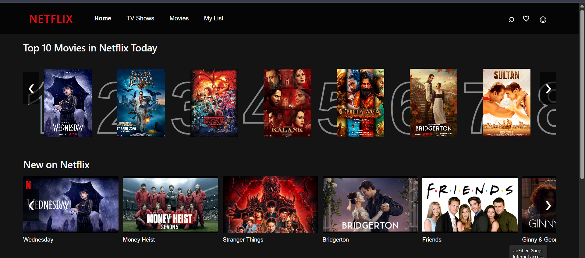
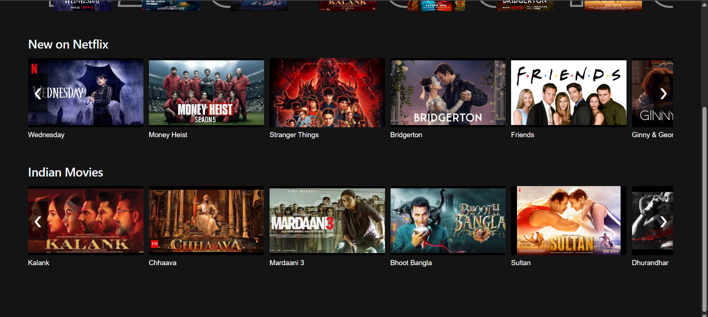
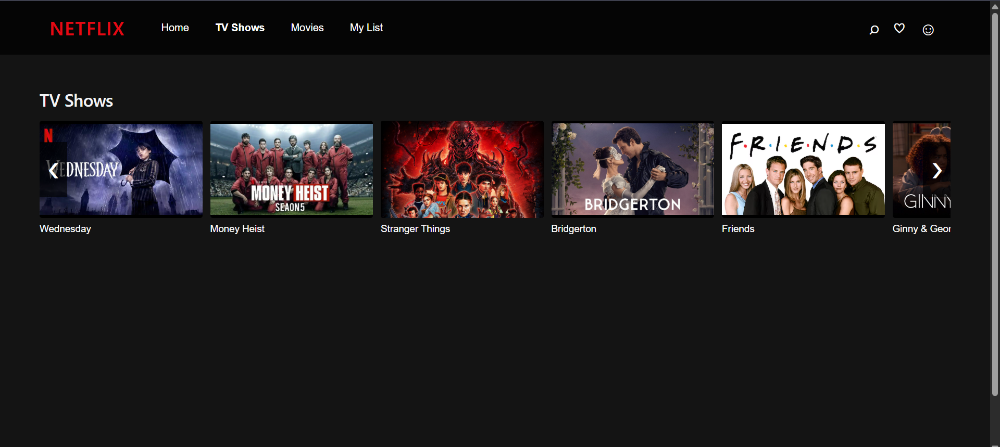
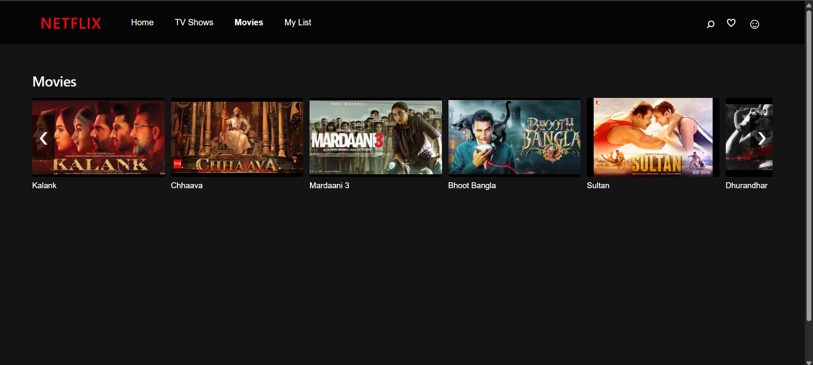
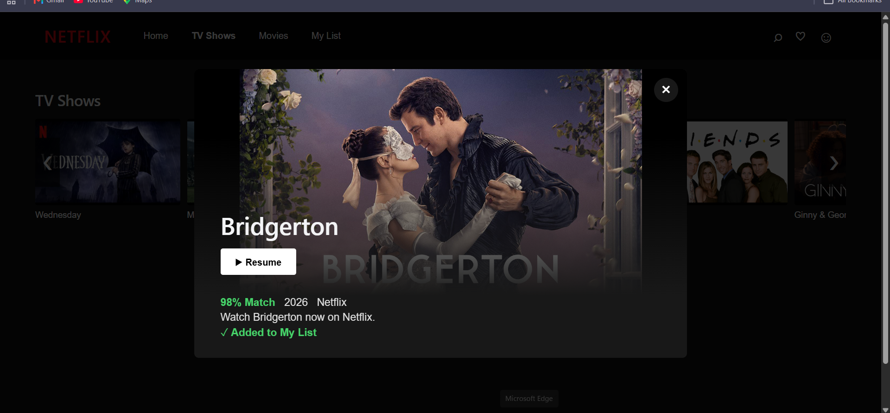
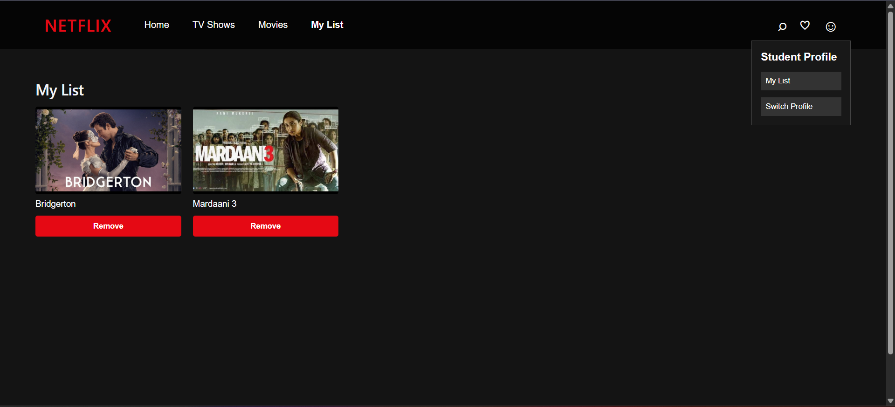

# 🎬 Netflix Clone

A modern **Netflix-inspired streaming platform** built with **React + Vite**. This project replicates the core browsing experience of Netflix with categorized content, interactive carousels, detailed preview modals, and a personalized **My List** feature using Local Storage.

---

## 🚀 Live Demo

🔗 https://cse-16-236-aw3k1e4h2-anshita-garg.vercel.app/

---

## 📌 Features

- 🎥 Netflix-inspired modern UI
- 🏠 Home page with multiple content sections
- 📺 Dedicated TV Shows page
- 🎬 Dedicated Movies page
- ⭐ Top 10 Movies carousel
- ➡️ Horizontal sliders with navigation controls
- 🔍 Interactive movie/show cards
- 📖 Detailed preview modal for every title
- ❤️ Add or remove titles from **My List**
- 💾 Persistent storage using Local Storage
- 👤 Profile dropdown menu
- 📱 Responsive design for different screen sizes
- ⚡ Built with Vite for fast performance

---

## 🛠️ Tech Stack

| Technology | Purpose |
|------------|---------|
| React.js | Frontend Framework |
| JavaScript (ES6+) | Application Logic |
| HTML5 | Structure |
| CSS3 | Styling & Responsive Design |
| Vite | Development & Build Tool |
| Local Storage | Persist My List Data |

---

# 📸 Project Preview

## 🏠 Home Page



---

## 🎬 Trending & Categories



---

## 📺 TV Shows Page



---

## 🎥 Movies Page



---

## ❤️ Add to My List

Clicking a title opens a detailed preview where users can add it to **My List**.



---

## 📑 My List

Saved titles remain available using **Local Storage**, even after refreshing the page.



---

# ⚙️ Installation

Clone the repository

```bash
git clone https://github.com/anshita14garg-blip/CSE16_236.git
```

Navigate to the project

```bash
cd netflix-clone
```

Install dependencies

```bash
npm install
```

Start the development server

```bash
npm run dev
```

Build for production

```bash
npm run build
```

---

## 💡 Future Improvements

- User Authentication
- TMDB API Integration
- Search Functionality
- Video Player
- Genre Filtering
- Dark/Light Theme
- Firebase Backend
- Watch History
- Continue Watching Section

---

## 👩‍💻 Author

**Anshita Garg**

GitHub: https://github.com/anshita14garg-blip

---

## ⭐ Show Your Support

If you liked this project, consider giving it a ⭐ on GitHub!
